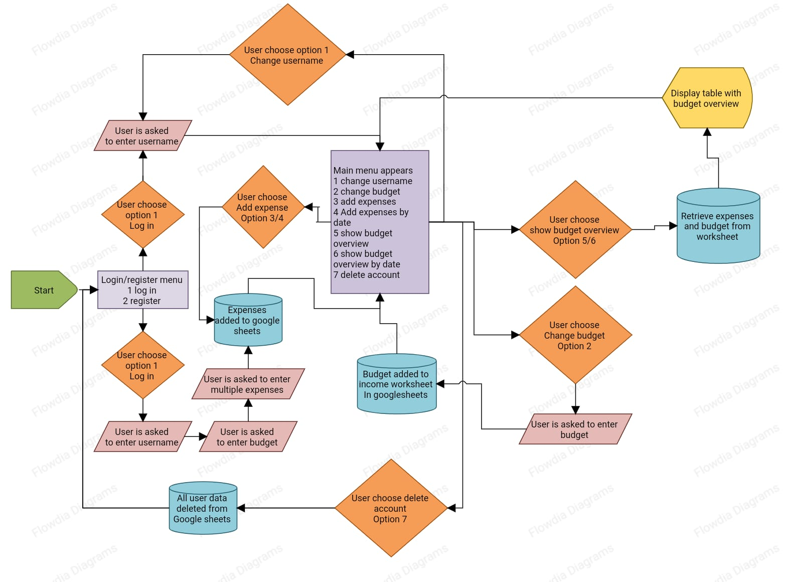

Welcome to, 

# Budget Tracker

The live link can be found here - [Budget Tracker](https://budget-tracker-pp3-c52ef7ed0210.herokuapp.com/)

(Developer: Jamie O'Neill)

## Introduction

Welcome to the Budget Tracker App! This simple yet powerful application is designed to help you take control of your finances and manage your expenses and income with ease.

___

## Table of Contents

- [Project Goals](#project-goals)
- [User Experience](#user-experience)
- [Design](#design)
- [Features](#features)
- [Technologies](#technologies)
- [Testing](#testing)
- [Bugs](#bugs)
- [Deployment](#deployment)
- [Clone the Repository Code Locally](#clone-the-repository-code-locally)
- [Credits](#credits)
      

___

## Project Goals

The goals of this website include:

- __User Goals__

  - Expense Tracking: Users want to easily and accurately track their daily expenses, including purchases, bills, and other financial transactions. They aim to gain a clear understanding of where their money is going.

  - Budget Management: Users aim to set and manage budgets for different spending categories, such as groceries, entertainment, and utilities. They want to stay within their budget limits and receive alerts when approaching or exceeding them.

  - Savings and Investment: Users may have specific savings or investment goals, such as saving for retirement, a down payment on a house, or a child's education. They want to track their progress toward these goals and make adjustments as needed.

  - Financial Insights: Users want to gain insights into their financial habits and patterns. They look for reports, charts, and visualizations that provide a clear overview of their income, expenses, and savings over time. These insights help them make more informed financial decisions.

- __Site Owner Goals__

  - Create an Application that Helps Users Track Their Budget and Get Better at Budgeting
  - Create an easy to use website and user interface.

  [Back to Table of Contents](#table-of-contents)

___

## User Experience

- __Target Audience__

  - The target audience for the budget tracker application includes a diverse range of individuals who are interested in managing their personal finances more effectively.

- __User Stories__

  - Here are the Users stories which can also be found here on the [project kanban board](https://github.com/users/jamie33o/projects/13):

 - __Players__

1.	As a **user** I can **view the results in the terminal** so that **I can see where I went over budget**
2.	As a **user** I can **search budget my date** so that **i can compare my weekly budget**
3.	As a **user** I can **register my username and budget** so that **the game can check if i went over budget**
4.	As a **user** I can **view a terminal logo** so that **I know that I am on on the rite site**
5.	As a **user** I can **enter my username** so that **I can get all data related to my username**
6.	As a **user** I can **login** so that **i can add expenses to my account**
7.	As a **user** I can **update my expenses on different dates** so that **I can fix any mistakes**
8.	As a **user** I can **select delete** so that **I can delete my accout**

[Back to Table of Contents](#table-of-contents)

___

## Design

- __Design Choices__

As this program was built for the terminal, there wasn't much in terms of design or colour but I did use ANSI escape codes to add a bit of colour where I felt was needed within the terminal to make certain parts stand out to the user.

- __Flowchart__ 

[Back to Table of Contents](#table-of-contents)

___
