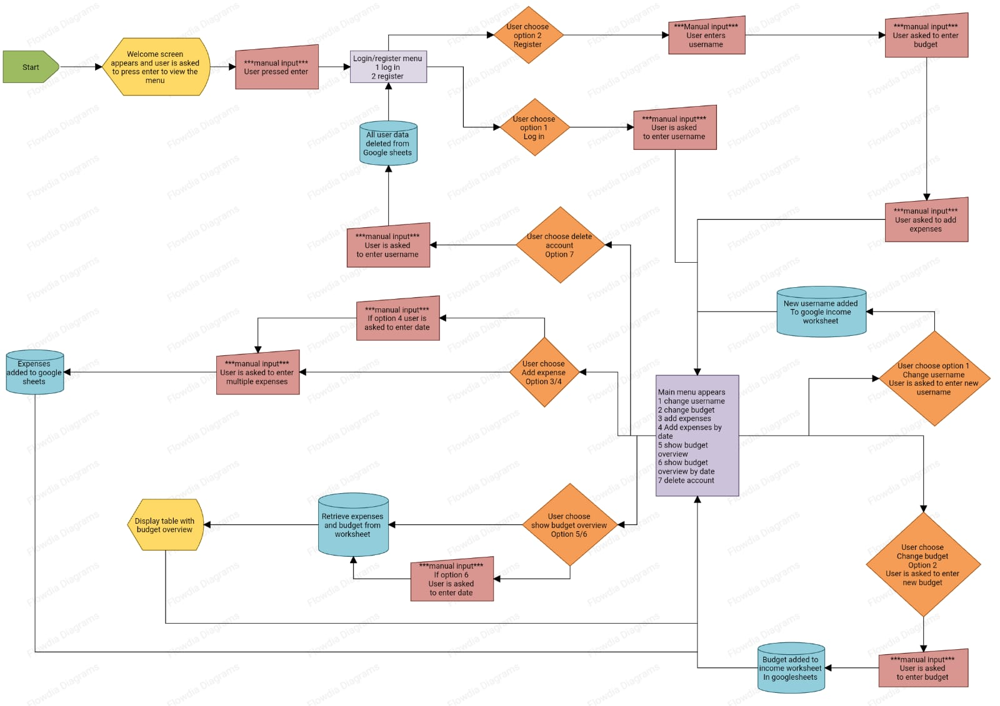

Welcome to, 

# Budget Tracker

The live link can be found here - [Budget Tracker](https://budget-tracker-pp3-c52ef7ed0210.herokuapp.com/)

(Developer: Jamie O'Neill)

## Introduction

Welcome to the Budget Tracker App! This simple yet powerful application is designed to help you take control of your finances and manage your expenses and income with ease.

___

## Table of Contents

- [Project Goals](#project-goals)
- [User Experience](#user-experience)
- [Design](#design)
- [Features](#features)
- [Technologies](#technologies-used)
- [Testing](#testing)
- [Bugs](#bugs)
- [Deployment](#deployment)
- [Clone the Repository Code Locally](#clone-the-repository-code-locally)
- [Credits](#credits)
      

___

## Project Goals

The goals of this website include:

- __User Goals__

  - Expense Tracking: Users want to easily and accurately track their daily expenses, including purchases, bills, and other financial transactions. They aim to gain a clear understanding of where their money is going.

  - Budget Management: Users aim to set and manage budgets for different spending categories, such as groceries, entertainment, and utilities. They want to stay within their budget limits and receive alerts when approaching or exceeding them.

  - Savings and Investment: Users may have specific savings or investment goals, such as saving for retirement, a down payment on a house, or a child's education. They want to track their progress toward these goals and make adjustments as needed.

  - Financial Insights: Users want to gain insights into their financial habits and patterns. They look for reports, charts, and visualizations that provide a clear overview of their income, expenses, and savings over time. These insights help them make more informed financial decisions.

- __Site Owner Goals__

  - Create an Application that Helps Users Track Their Budget and Get Better at Budgeting
  - Create an easy to use website and user interface.

  [Back to Table of Contents](#table-of-contents)

___

## User Experience

- __Target Audience__

  - The target audience for the budget tracker application includes a diverse range of individuals who are interested in managing their personal finances more effectively.

- __User Stories__

  - Here are the Users stories which can also be found here on the [project Kanban board](https://github.com/users/jamie33o/projects/13):

 - __Players__

1.	As a **user** I can **view the results in the terminal** so that **I can see where I went over budget**
2.	As a **user** I can **search budget my date** so that **I can compare my weekly budget**
3.	As a **user** I can **register my username and budget** so that **the game can check if I went over budget**
4.	As a **user** I can **view a terminal logo** so that **I know that I am on on the right site**
5.	As a **user** I can **enter my username** so that **I can get all data related to my username**
6.	As a **user** I can **login** so that **I can add expenses to my account**
7.	As a **user** I can **update my expenses on different dates** so that **I can fix any mistakes**
8.	As a **user** I can **select delete** so that **I can delete my account**

[Back to Table of Contents](#table-of-contents)

___

## Design

- __Design Choices__

As this program was built for the terminal, there wasn't much in terms of design or colour but I did use ANSI escape codes to add a bit of colour where I felt was needed within the terminal to make certain parts stand out to the user.

- __Flowchart__ 

[Back to Table of Contents](#table-of-contents)

___

## Features

#### Welcome screen
  

- On the welcome screen there is a logo and a welcome message then the user is asked to press enter to view the menu

   

- Register/Log in menu

  - Register/Log menu: The user will be asked to chose an option 1. login 2. register 

     

- Main menu 

  - The main menu has 7 options for the user to choose from with full crud functionality 

  

- Change Username

  - If the user chooses change username(option 1) they will be asked to enter there new username 

  
- Change budget

  - If the users chooses change budget(option2) they will be asked to enter there new budget
 

- Add/update today's expenses

  - If the user chooses Add/update today's expenses(option 3) they will be asked multiple question's about there spending and input an amount for each question

- Update expenses by date

  - If the user chooses Update expenses by date(option 4) they will be asked to enter the date for which they want to update the expenses

- View budget overview for previous 7 days from current date

  - If the user chooses View budget overview for previous 7 days from current date(option 5) the will be presented with a table showing expenses for the last 7days and also a separate table showing budget , total expenses and savings
    

- View budget overview for previous 7 days from date entered

  - If the user chooses View budget overview for previous 7 days from date entered(option 6) they wil be asked to enter a date and then given a budget overview 7 days previous from that date

- Delete all data linked to username

  - If user chooses Delete all data linked to username(option 7) they will be asked to enter there username and then all data related to there username will be deleted

### __Technologies Used__
The following is a list of the technologies I used on this project.
- [Python](https://en.wikipedia.org/wiki/Python_(programming_language))
    - The program was written entirely in Python.
- [HTML](https://en.wikipedia.org/wiki/HTML5)
    - HTML was used to.
- [JavaScript](https://en.wikipedia.org/wiki/JavaScript)
    - The script used to run the Code Institute mock terminal is done with JavaScript.
- [Google Sheets](https://www.google.com/sheets/about/)
    - Google sheets is used to store the data.
- [Google Cloud](https://console.cloud.google.com/)
    - Google cloud was used to enable the APIs needed for this project.
- [Github](https://github.com/)
    - Github was used to store the project's code after being pushed from Git.
- [Vscode](https://r.search.yahoo.com/_ylt=Awr.ioz.dfxkmvcVrB8M34lQ;_ylu=Y29sbwNpcjIEcG9zAzEEdnRpZAMEc2VjA3Ny/RV=2/RE=1694295679/RO=10/RU=https%3a%2f%2fcode.visualstudio.com%2f/RK=2/RS=zxlvA43UZMryfKUhyBe_Jk0Z8MQ-)
    - Vscode terminal was used to commit my code using Git and push it to Github.
- [Git](https://git-scm.com/)
    - Git was used for version control through the vscode terminal.

### __Imported Libraries and Packages__
- [tabulate](https://pypi.org/project/tabulate/) was used to create a nice table layout for the data
- [os](https://docs.python.org/3/library/os.html) was used to create the clear_screen function to enhance user experience and reduce clutter on screen.
- [re](https://docs.python.org/3/library/re.html) regular expression was used to check date input
- [sys](https://docs.python.org/3/library/sys.html) was used to print text slow letter by letter
- [gspread](https://docs.gspread.org/en/v5.7.0/) was used to link the program to Google Sheets to read and update the leader-board.

[Back to Table of Contents](#table-of-contents)

## Testing 

View Testing and Validation [here.](TESTING.md)

[Back to Table of Contents](#table-of-contents)

## Bugs

| **Bug** | **Fix** |
| --- | --- |
| Bug: Menu not showing after user is finished with an option| Solution: Put menu inside of a while loop so it gets called each time the user is finished with the option they chose |
| Bug: Menu showing when user deletes account. | Solution: Add if statement in menu function to check if the users username is stored if its not show login/register menu|
| Bug: User adds expenses but they don't get added to worksheet | Solution: Reviewed the code in questions.py where the questions for adding expenses are and realised the prices dictionary was not being passed to the questions function so I passed the prices dictionary as a parameter |
| Bug: Budget overview was returning an error | Solution: Reviewed the expenses worksheet and identified that register function was adding the username to expenses worksheet with no other data so I removed the part the register function where it was adding the username as it wasn't needed |
| Bug: User could add wrong input and app would stop | Solution: Added input validator function to re-use on all inputs |

### Unfixed Bugs 

- No known unfixed bugs

[Back to Table of Contents](#table-of-contents)

## Deployment

### Version Control
The site was created using the Visual Studio code editor and pushed to github to the remote repository ‘budget-tracker-pp3’.

The following git commands were used throughout development to push code to the remote repo:

- git add <file> - This command was used to add the file(s) to the staging area before they are committed.

- git commit -m “commit message” - This command was used to commit changes to the local repository queue ready for the final step.

- git push - This command was used to push all committed code to the remote repository on github.

### Heroku Deployment

This project uses [Heroku](https://www.heroku.com), a platform as a service (PaaS) that enables developers to build, run, and operate applications entirely in the cloud.

Deployment steps are as follows, after account setup:

- Select *New* in the top-right corner of your Heroku Dashboard, and select *Create new app* from the dropdown menu.
- Your app name must be unique, and then choose a region closest to you (EU or USA), and finally, select *Create App*.
- From the new app *Settings*, click *Reveal Config Vars*, and set the value of KEY to `PORT`, and the value to `8000` then select *add*.
- Further down, to support dependencies, select *Add Buildpack*.
- The order of the buildpacks is important, select `Python` first, then `Node.js` second. (if they are not in this order, you can drag them to rearrange them)

Heroku needs two additional files in order to deploy properly.
- requirements.txt
- Procfile

You can install this project's requirements (where applicable) using: `pip3 install -r requirements.txt`. If you have your own packages that have been installed, then the requirements file needs updated using: `pip3 freeze --local > requirements.txt`

The Procfile can be created with the following command: `echo web: node index.js > Procfile`

For Heroku deployment, follow these steps to connect your GitHub repository to the newly created app:

- In the Terminal/CLI, connect to Heroku using this command: `heroku login -i`
- Set the remote for Heroku: `heroku git:remote -a <app_name>` (replace app_name with your app, without the angle-brackets)
- After performing the standard Git `add`, `commit`, and `push` to GitHub, you can now type: `git push heroku main`

The frontend terminal should now be connected and deployed to Heroku.

### Clone the Repository Code Locally
- Navigate to the GitHub Repository you want to clone to use locally:
  - Click on the code drop down button
  - Click on HTTPS
  - Copy the repository link to the clipboard
  - Open your IDE of choice (git must be installed for the next steps)
  - Type git clone copied-git-url into the IDE terminal
  - The project will now of been cloned on your local machine for use.

[Back to Table of Contents](#table-of-contents)

## Credits 

Here we credit everywhere we have got content for the website and any code that was taken from other sources.

### Code 

- The code for clearing the terminal was got from [stack overflow](https://stackoverflow.com/questions/2084508/clear-terminal-in-python)
- The code for slow print effect was got from [stack overflow](https://stackoverflow.com/questions/4099422/printing-slowly-simulate-typing)
- The code for connecting to google sheets was got from [code institute](https://learn.codeinstitute.net/courses/course-v1:CodeInstitute+LS101+2021_T1/courseware/293ee9d8ff3542d3b877137ed81b9a5b/071036790a5642f9a6f004f9888b6a45/)

### __Design__
- Flowchart was made using [Flowdia Diagrams](https://play.google.com/store/apps/details?id=com.bezapps.flowdia)

## __Acknowledgements__
I would like to give special thanks to my mentor, [Gareth McGirr](https://github.com/Gareth-McGirr) for his guidance during the development of this project.
[Back to Table of Contents](#table-of-contents) 