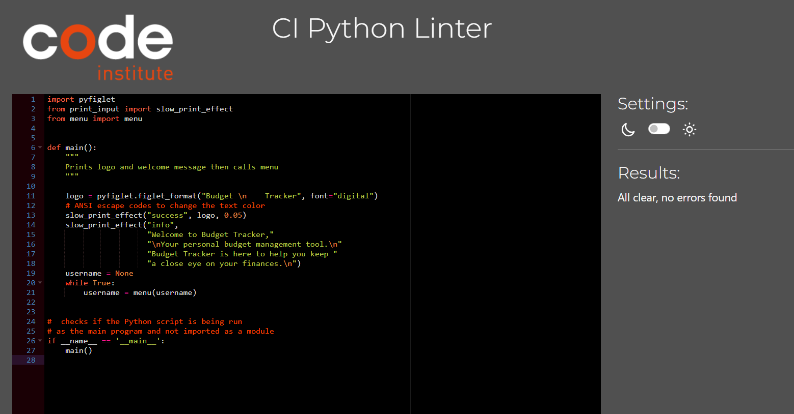
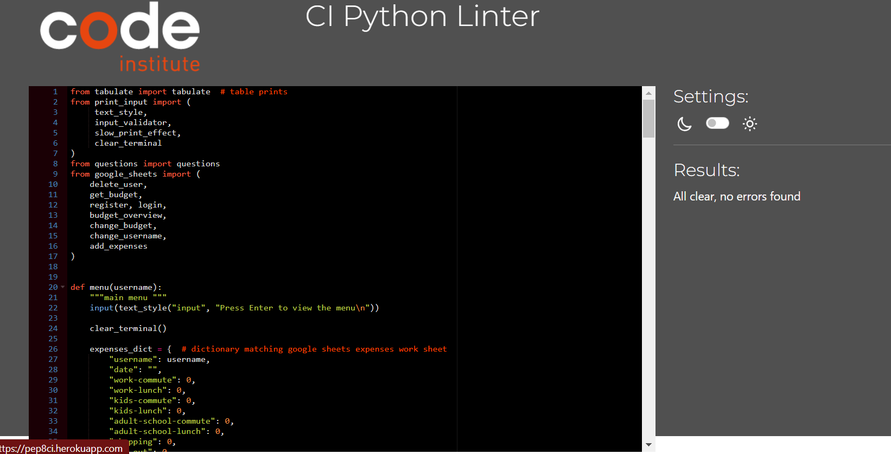
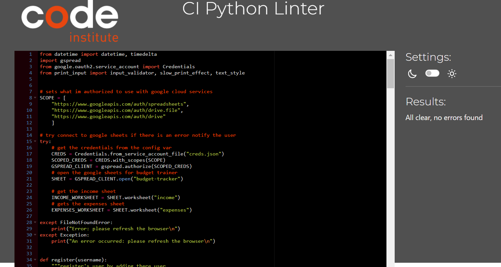
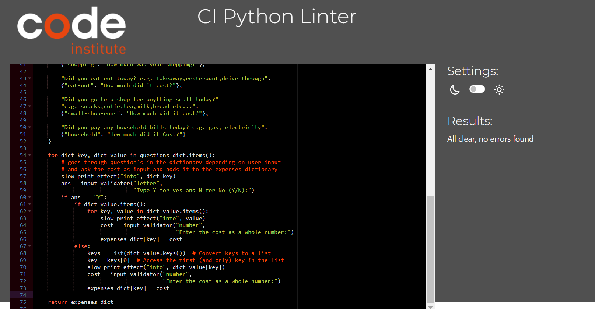
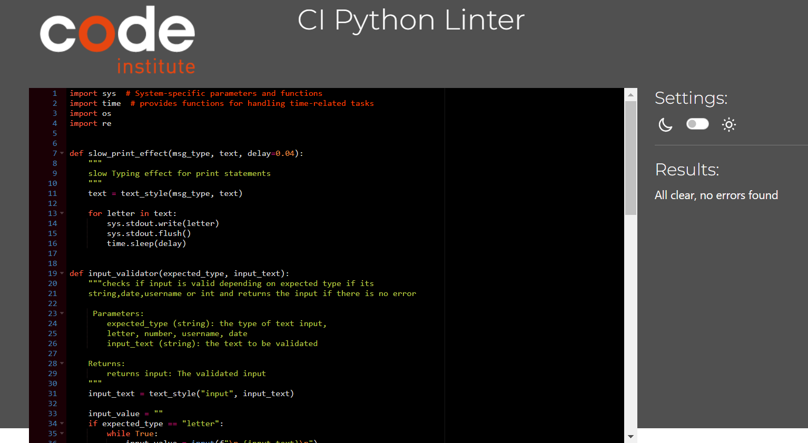

### Python Validation

I validated both my files using [Code Institute's Python Linter](https://pep8ci.herokuapp.com/) and was met with no errors.

| File Validated | Image |
| -------------- | ----- |
| [run.py](https://pep8ci.herokuapp.com/https://raw.githubusercontent.com/jamie33o/budget-tracker-pp3/main/run.py) |  |
| [menu.py](https://pep8ci.herokuapp.com/https://raw.githubusercontent.com/jamie33o/budget-tracker-pp3/main/menu.py) |  |
| [google_sheets.py](https://pep8ci.herokuapp.com/https://raw.githubusercontent.com/jamie33o/budget-tracker-pp3/main/google_sheets.py) |  |
| [questions.py](https://pep8ci.herokuapp.com/https://raw.githubusercontent.com/jamie33o/budget-tracker-pp3/main/questions.py) |  |
| [print_input.py](https://pep8ci.herokuapp.com/https://raw.githubusercontent.com/jamie33o/budget-tracker-pp3/main/print_input.py) |  |

### Testing user stories

User Story 1:
As a **user** I can **view the results in the terminal** so that **I can see where I went over budget**

| **Feature** | **Action** | **Expected Result** | **Actual Result** |
|-------------|------------|---------------------|-------------------|
| choose view budget overview | player selects option | budget overview appears in a table | Works as expected |

User Story 2:
As a **user** I can **search budget my date** so that **I can compare my weekly budget**

| **Feature** | **Action** | **Expected Result** | **Actual Result** |
|-------------|------------|---------------------|-------------------|
| view budget by date	| User selects option | Budget appears in table for 7 days before the date the user entered | Works as expected |

User Story 3:
As a **user** I can **register my username and budget** so that **the game can check if I went over budget**

| **Feature** | **Action** | **Expected Result** | **Actual Result** |
|-------------|------------|---------------------|-------------------|
| Register | User opens the site and chooses register | User gets notified of success | Works as expected |

User Story 4:
As a **user** I can **view a terminal logo** so that **I know that I am on on the rite site**

| **Feature** | **Action** | **Expected Result** | **Actual Result** |
|-------------|------------|---------------------|-------------------|
| Budget Tracker logo | User opens website | Logo appears | Works as expected |

User Story 5:
As a **user** I can **enter my username** so that **I can get all data related to my username**

| **Feature** | **Action** | **Expected Result** | **Actual Result** |
|-------------|------------|---------------------|-------------------|
| enter username | User logs in | chooses budget overview all user data appears | Works as expected |

User Story 6:
As a **user** I can **login** so that **I can add expenses to my account**

| **Feature** | **Action** | **Expected Result** | **Actual Result** |
|-------------|------------|---------------------|-------------------|
| Log in | chooses add expenses | User is asked question and inputs expense | Works as expected |

User Story 7:
As a **user** I can **update my expenses on different dates** so that **I can fix any mistakes**

| **Feature** | **Action** | **Expected Result** | **Actual Result** |
|-------------|------------|---------------------|-------------------|
| add expenses on certain date | User chooses add expense by date | expense updated for date entered | Works as expected |

User Story 8:
As a **user** I can **select delete** so that **I can delete my account**

| **Feature** | **Action** | **Expected Result** | **Actual Result** |
|-------------|------------|---------------------|-------------------|
| delete account | User selects delete account | all user data deleted | Works as expected |

### Manual Testing

| Section Tested | Input To Validate | Expected Outcome | Actual Outcome | Pass/Fail |
| -------------- | ----------------- | ---------------- | -------------- | --------- |
| Start Program | N/A | Load welcome message and prompt user to press enter to view the menu | As expected | PASS |
| Login / Register menu | N/A | Load menu user asked to choose an option| As expected | PASS |
| Login / Register menu | Input "4" | Notify user that this isn't a valid input: **Please enter 1 or 2** and loop back | As expected | PASS |
| Login / Register menu | Input "letter" | Notify user that this isn't a valid input: **Wrong input please enter a whole number** and loop back | As expected | PASS |
| Login / Register menu | Input "1" | User is asked to Enter there Username | As expected | PASS |
| Login | Input "Jamie oneill32" | Notify user that this isn't a valid input: **username must be 5-10 characters long** and loop back | As expected | PASS |
| Login | Input "Jamie32" | Notify user that they are logged in: **Congratulation's you are logged in!!!** and exit loop back to menu | As expected | PASS |
| Login / Register menu | Input "2" | User is asked to Enter there Username | As expected | PASS |
| Register | Input "Jamie32" | Notify user that they are Registered in: **Congratulation's you are registered!!!** and exit loop to menu | As expected | PASS |
| Main Menu | Input "9" | Notify user that this isn't a valid input: **9 is not an option!!!** and loop back | As expected | PASS |
| Main Menu | Input "1" | User is asked to enter new username | As expected | PASS |
| Change Username | Input "jamie4" | Notify user that there username is changed | As expected | PASS |
| Main Menu | Input "2" | User is asked to enter a new budget amount | As expected | PASS |
| New budget | Input "900" | Notify user that there budget is changed  | As expected | PASS |
| Main Menu | Input "3" | User is asked multiple questions and enters expense as input | As expected | PASS |
| Main Menu | Input "4" | User is asked to enter a date | As expected | PASS |
| Main Menu | Input "5" | User is presented with there budget overview | As expected | PASS |
| Main Menu | Input "6" | User is asked to enter a date | As expected | PASS |
| Main Menu | Input "7" | User is asked to enter username | As expected | PASS |
